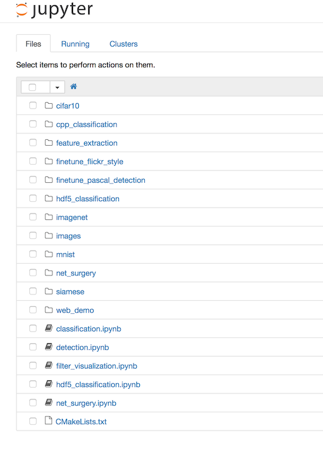
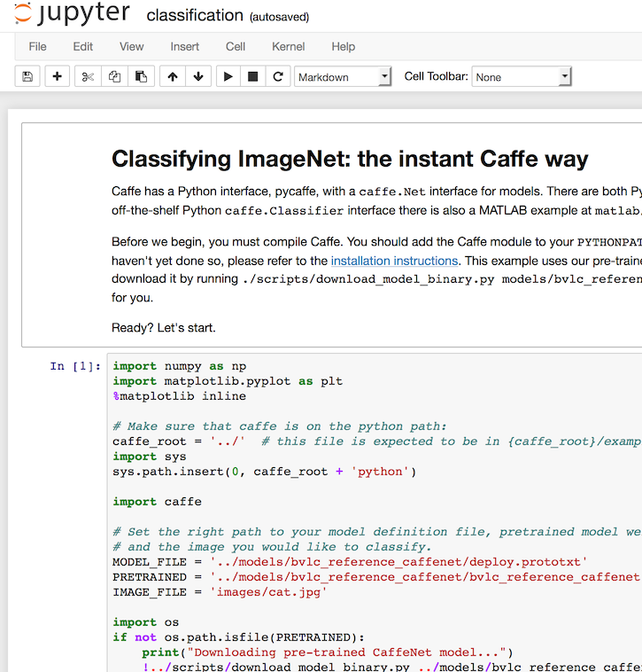

## Running an example

1. Start the container:

   ```
   vagrant up
   ```

2. Start the IPython notebook server:

   ```
   n
   ```

   `n` is an alias for:

   ```
   ipython notebook --ip=0.0.0.0 --no-browser --notebook-dir=/caffe/examples
   ```

3. Navigate to [http://127.0.0.1:9888](http://127.0.0.1:9888):

   

4. Open the [classification.ipynb](http://127.0.0.1:9888/notebooks/classification.ipynb) notebook. Walk through it to perform an introductory classification using a pretrained model:

   


## Notes

The packages installed the first time are cached outside the container. On my system, it took sixteen-minutes to start the first container and four-minutes to start the next.
